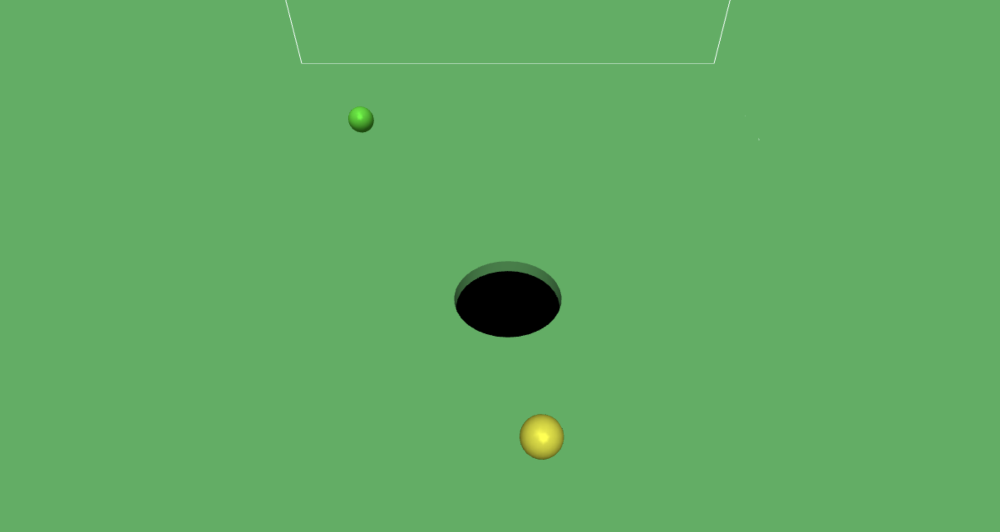
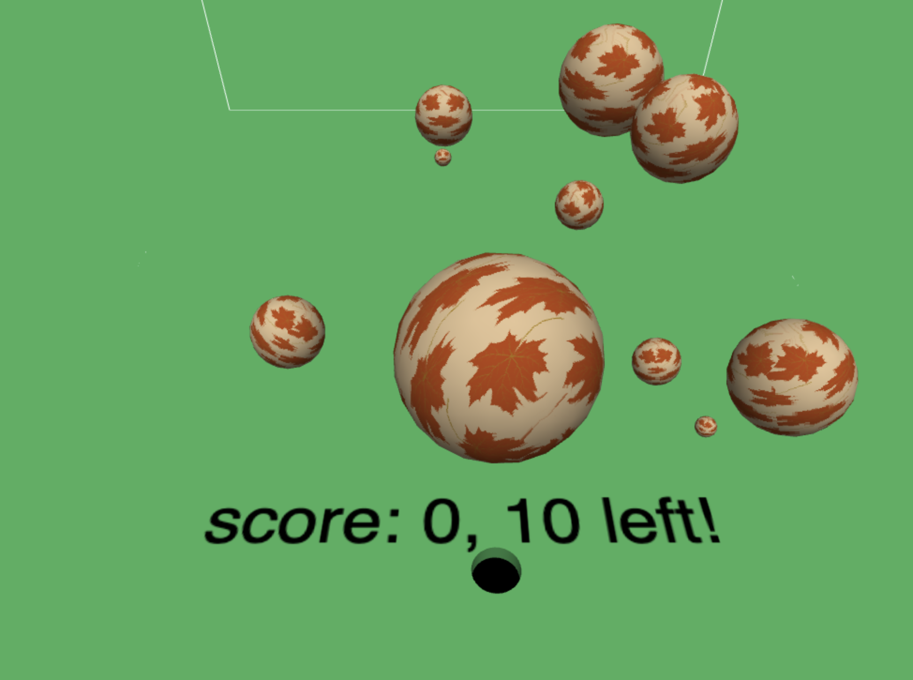

# Hole in the Ground

Assignment 2 from CSCI-4611: Programming Interactive Computer Graphics and Games, University of Minnesota Twin Cities.  
The purpose of this game is about learning to use `Vector` in 3D graphics and physical simulations.

## Recommenation
To ensure this graphic work smoothly, use `Google Chrome` or `Microsoft Edge`

## Link to Github Page

Use this link to play the game: https://chorkhieng.github.io/Hole-in-the-Ground/  

Use arrow keys to move the hole. When an object fell into the hole, hole's radius will increase.

## Sample Scene  

Start Scene  

Explosion in the sky when the ship collides with mine(s)
